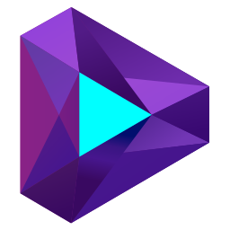
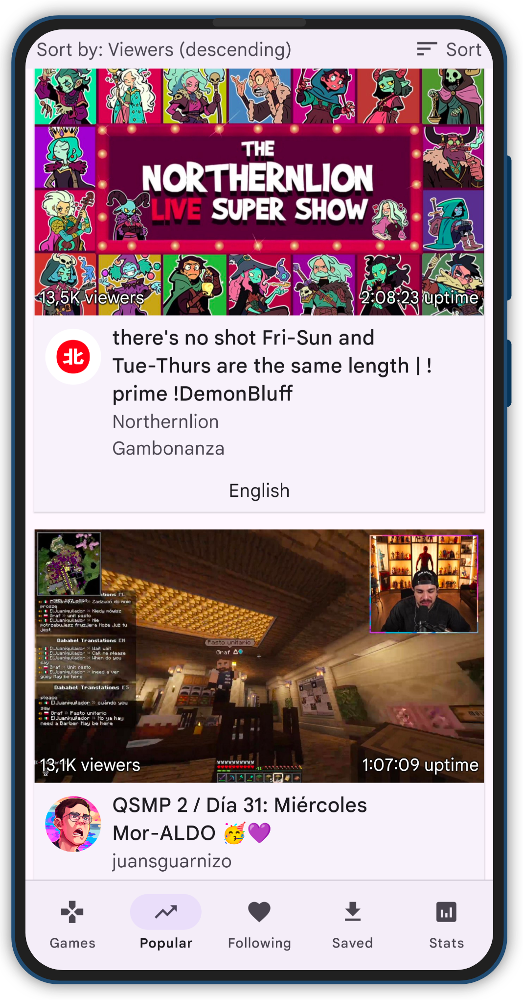
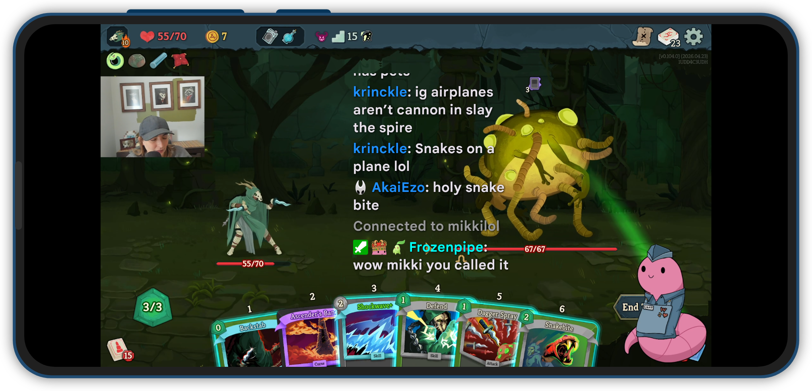
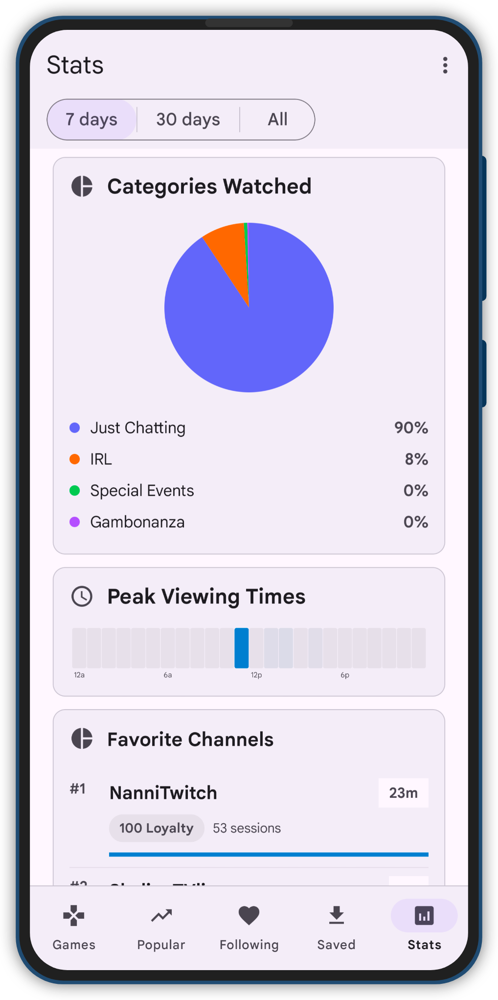
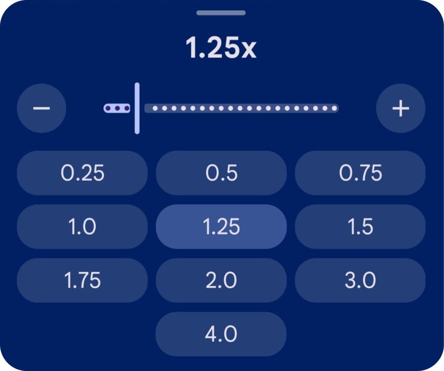
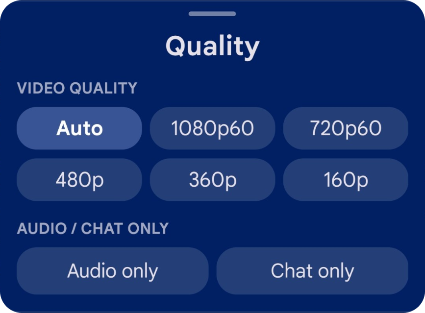
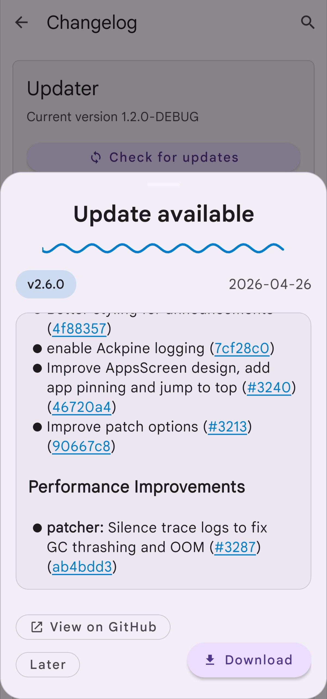
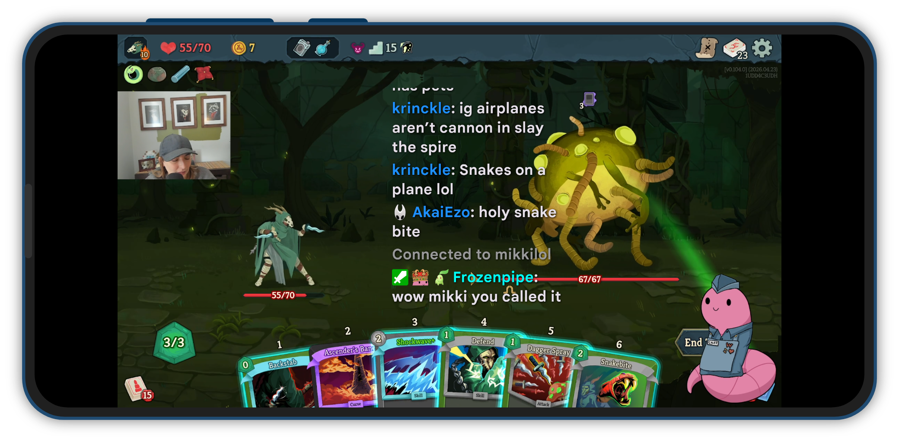

<p align="center">
  
</p>

<h1 align="center">ThystTV</h1>

<p align="center">
  A better Twitch client for Android, focused on player polish, floating chat, local viewing stats, and large-screen comfort.
</p>

<p align="center">
  <a href="https://github.com/tzii/ThystTV/tree/release/1.2-prep"></a>
  <a href="https://github.com/tzii/ThystTV/blob/release/1.2-prep/LICENSE"></a>
  
  
</p>

<p align="center">
  <a href="#screenshots">Screenshots</a>
  ·
  <a href="#what-thysttv-adds">Features</a>
  ·
  <a href="#build-from-source">Build</a>
  ·
  <a href="#credit">Credit</a>
</p>

---

## What is ThystTV?

**ThystTV** is a third-party Twitch client for Android. It is based on [Xtra](https://github.com/crackededed/Xtra), with ThystTV-specific work aimed at making the viewing experience cleaner, faster, and more comfortable on phones, tablets, and large displays.

The current focus is the `release/1.2-prep` branch: player refinement, better floating chat behavior, local watch-history insights, repo polish, and a more complete project presentation.

> ThystTV is a fork of Xtra. A lot of credit goes to the Xtra project for the foundation this app builds on.

## Project status

| Area | Current detail |
|---|---|
| Repository | [`tzii/ThystTV`](https://github.com/tzii/ThystTV) |
| Active branch | [`release/1.2-prep`](https://github.com/tzii/ThystTV/tree/release/1.2-prep) |
| Release target | `1.2.0` |
| License | [GNU AGPL-3.0](LICENSE) |
| Primary language | Kotlin, with Java components |

## Screenshots

<table>
  <tr>
    <td width="33%" align="center">
      <strong>Popular streams</strong><br><br>
      
    </td>
    <td width="34%" align="center">
      <strong>Full-screen player</strong><br><br>
      
    </td>
    <td width="33%" align="center">
      <strong>Local stats</strong><br><br>
      
    </td>
  </tr>
</table>

<table>
  <tr>
    <td width="33%" align="center">
      <strong>Playback speed</strong><br><br>
      
    </td>
    <td width="34%" align="center">
      <strong>Video quality</strong><br><br>
      
    </td>
    <td width="33%" align="center">
      <strong>Updater changelog</strong><br><br>
      
    </td>
  </tr>
</table>

## Floating chat

Floating chat is one of ThystTV's headline viewing upgrades. It keeps chat available during full-screen playback without forcing the player into a cramped split layout.

<p align="center">
  
</p>

<p align="center">
  <a href="docs/images/readme/floating-chat.mp4">Watch the floating chat demo video</a>
</p>

## What ThystTV adds

### Player refinement

- Gesture-based playback controls for horizontal seek, playback speed, brightness, and volume.
- Clearer feedback while interacting with the player.
- Better visual handling for minimized player states.
- VoD scrubbing improvements that scale with video duration.

### Floating chat

- Chat overlay designed for full-screen viewing.
- A cleaner way to keep stream context visible while the video remains primary.
- Better fit for phones, tablets, and wide layouts.

### Local stats

- Watch-history and screen-time insights.
- Category breakdowns and viewing patterns.
- Favorite channel and session-focused views.
- Stats stay local on the device.

### Updater and changelog

- In-app update checks with release details.
- Changelog previews before downloading a new build.
- Direct links to the GitHub release when more context is needed.

### Large-screen comfort

- Layout work for tablets and wider Android screens.
- Player and browsing screens tuned to avoid cramped controls.
- More polished presentation for the 1.2 release cycle.

## Build from source

Recommended local setup:

- Android Studio, current stable release
- JDK 21
- Android SDK matching the project configuration

```bash
./gradlew assembleDebug
./gradlew test
./gradlew assembleRelease
```

On Windows:

```powershell
.\gradlew.bat assembleDebug
.\gradlew.bat test
.\gradlew.bat assembleRelease
```

## Downloads

The active release work is currently happening on [`release/1.2-prep`](https://github.com/tzii/ThystTV/tree/release/1.2-prep). Use the repository releases page when tagged builds are published.

## Documentation

- [Roadmap](docs/ROADMAP.md)
- [Testing guide](docs/TESTING.md)
- [Manual QA](docs/MANUAL_QA.md)
- [Player notes](docs/PLAYER.md)
- [Gesture system](docs/GESTURE_SYSTEM.md)
- [Release process](docs/RELEASE_PROCESS.md)
- [1.2 release plan](docs/RELEASE_1_2_PLAN.md)
- [Upstream sync policy](docs/UPSTREAM_SYNC.md)
- [Visual identity](docs/VISUAL_IDENTITY.md)

## Contributing

Contributions should stay focused, reviewable, and easy to test. For UI work, include screenshots. For player or gesture changes, include manual test notes for live playback, VoDs, orientation changes, and minimize/restore behavior.

Read [CONTRIBUTING.md](CONTRIBUTING.md) before opening a non-trivial pull request.

## Credit

ThystTV is based on [Xtra](https://github.com/crackededed/Xtra). The upstream project deserves major credit for the base client, architecture, and years of work that made this fork possible.

## License

ThystTV is licensed under the [GNU Affero General Public License v3.0](LICENSE).
